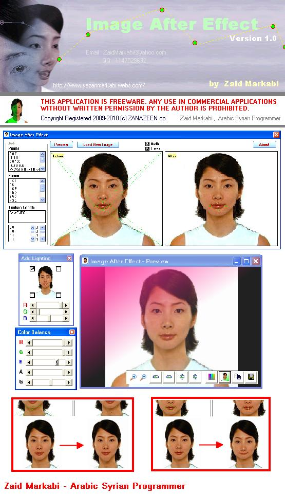



## I\.A\.F \- Image After Effect \- ver\.1

### Description

(IAE) let you to add effects on your photos,

you can change mouth, eyes and your other face styles..

using DirectX 8.1 &amp; Truevision3D 6.2
 
### More Info
 

             |
---                |---
**Submitted On**   |2009-08-11 19:44:08
**By**             |[Zaid Markabi](https://github.com/Planet-Source-Code/PSCIndex/blob/master/ByAuthor/zaid-markabi.md)
**Level**          |Advanced
**User Rating**    |4.0 (16 globes from 4 users)
**Compatibility**  |VB 5\.0, VB 6\.0
**Category**       |[DirectX](https://github.com/Planet-Source-Code/PSCIndex/blob/master/ByCategory/directx__1-44.md)
**World**          |[Visual Basic](https://github.com/Planet-Source-Code/PSCIndex/blob/master/ByWorld/visual-basic.md)
**Archive File**   |[I\_A\_F\_\-\_Im216152912009\.zip](https://github.com/Planet-Source-Code/zaid-markabi-i-a-f-image-after-effect-ver-1__1-72417/archive/master.zip)

